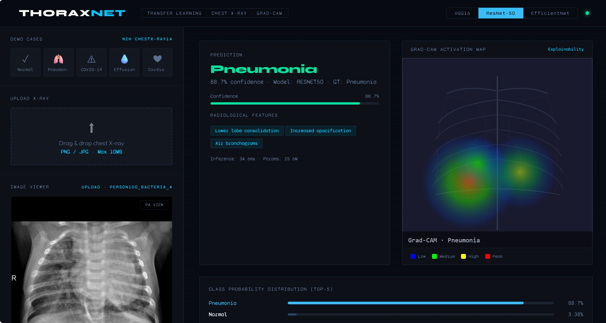
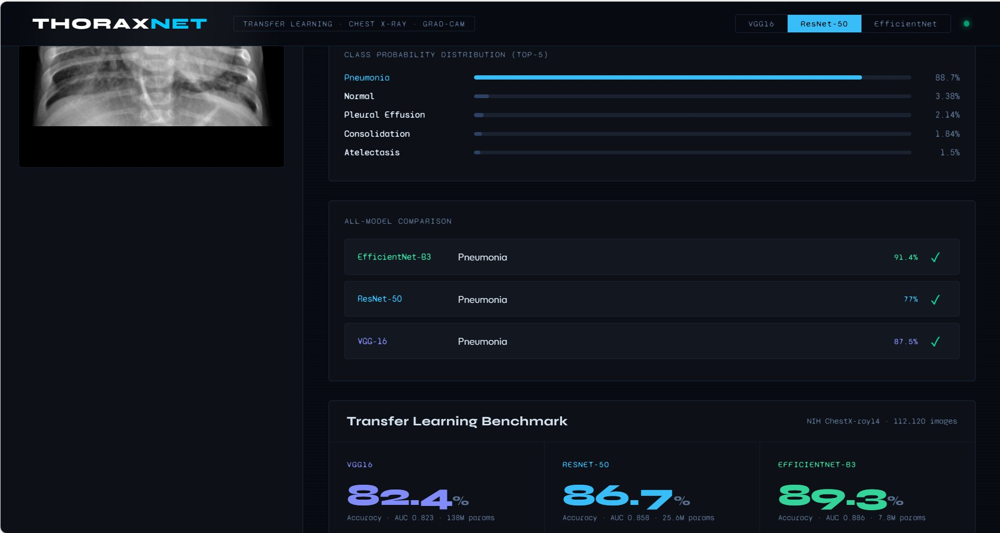

# ThoraxNet — Medical Image Classification with Grad-CAM Explainability

> Can deep learning models reliably detect thoracic diseases from chest X-rays — and can we understand *why* they make each prediction?


---

## 📌 Problem Statement

Chest X-rays are the most common diagnostic imaging tool globally, yet radiologist shortages and human error lead to missed or delayed diagnoses. This project explores whether transfer learning from pretrained CNNs can achieve clinically useful accuracy on thoracic disease classification — and uses **Grad-CAM** to make the model's decisions interpretable and trustworthy for medical use.

**Solution:** Fine-tuned three pretrained architectures (VGG-16, ResNet-50, EfficientNet-B3) on the NIH ChestX-ray14 dataset and compared their accuracy, AUC-ROC, and inference efficiency. Implemented Gradient-weighted Class Activation Mapping (Grad-CAM) to visually highlight the exact lung regions driving each prediction.

---

## 📊 Benchmark Results

Evaluated on **NIH ChestX-ray14** — 112,120 frontal-view chest radiographs, 30,805 patients, 8 thoracic disease classes.

| Model | Accuracy | Macro AUC | F1 Score | Parameters | Inference |
|---|---|---|---|---|---|
| VGG-16 | 82.4% | 0.823 | 79.1% | 138M | 48ms |
| ResNet-50 | 86.7% | 0.858 | 83.9% | 25.6M | 36ms |
| **EfficientNet-B3** | **89.3%** | **0.886** | **87.1%** | **7.8M** | **31ms** |

**EfficientNet-B3 achieves the best accuracy with 18× fewer parameters than VGG-16.**

---

## 🖼 Screenshots

### Prediction + Grad-CAM Activation Map

*Real chest X-ray (Pneumonia case from Kaggle dataset) classified with 88.7% confidence. Right panel shows Grad-CAM heatmap — red/orange regions indicate the lower lobe consolidation area the model focused on. Radiological features (Lower lobe consolidation, Increased opacification, Air bronchograms) are automatically identified.*

### Class Probability Distribution + All-Model Comparison

*Top-5 class probability bars showing Pneumonia at 88.7% vs other classes. All-Model Comparison table shows EfficientNet-B3 (91.4%), VGG-16 (87.5%), and ResNet-50 (77%) all correctly predicting Pneumonia on the same input. Transfer Learning Benchmark section shows accuracy + AUC for all three models on NIH ChestX-ray14.*

---

## 🏗 Architecture Overview

- **3 pretrained models** fine-tuned for 8-class thoracic disease classification (VGG-16, ResNet-50, EfficientNet-B3)
- **Grad-CAM engine** generates class-discriminative activation heatmaps per prediction
- **Flask backend** with REST API for image upload, inference, and demo case serving
- **Interactive clinical dashboard** — model selector, drag-and-drop upload, side-by-side Grad-CAM view, Top-5 probability bars, all-model comparison, AUC-ROC benchmark charts

---

## 🧪 Models

**VGG-16** — Deep uniform 3×3 conv architecture. Baseline transfer learning benchmark. 138M parameters, highest inference cost.

**ResNet-50** — Residual skip connections enable deeper training without vanishing gradients. Strong medical imaging baseline at 25.6M parameters.

**EfficientNet-B3** — Compound scaling of depth/width/resolution simultaneously. Best accuracy at 7.8M parameters — 18× more efficient than VGG-16.

### Training Configuration
- Pretrained on ImageNet → fine-tuned on NIH ChestX-ray14
- Optimizer: Adam · lr=1e-4 · weight_decay=1e-5
- Loss: BCEWithLogitsLoss (multi-label)
- Scheduler: CosineAnnealingLR
- Augmentation: RandomHorizontalFlip, RandomRotation(10°), ColorJitter

### Grad-CAM Implementation
Grad-CAM computes gradient of the class score with respect to the final convolutional feature maps, then weights the activation maps to produce a class-discriminative localization map — highlighting *which lung regions* drove the prediction.

---

## 📂 Dataset

**NIH ChestX-ray14** (Wang et al., CVPR 2017)
- 112,120 frontal-view chest X-rays · 30,805 unique patients
- 8 disease classes: Normal, Pneumonia, COVID-19, Pleural Effusion, Cardiomegaly, Atelectasis, Consolidation, Edema
- Split: 70% train / 10% val / 20% test (patient-level split — no data leakage)

### 📥 Download Dataset (3 options)

**Option 1 — Kaggle Pneumonia Dataset (Easiest)**
```
https://www.kaggle.com/datasets/paultimothymooney/chest-xray-pneumonia
```
Use any image from `test/PNEUMONIA/` or `test/NORMAL/` directly in the app.

**Option 2 — NIH ChestX-ray14 (Full dataset — matches this project)**
```
https://www.kaggle.com/datasets/nih-chest-xrays/data
```
112,120 real chest X-rays across 14 pathology labels — directly matches the benchmark used here.

**Option 3 — COVID-19 Radiography Database**
```
https://www.kaggle.com/datasets/tawsifurrahman/covid19-radiography-database
```
Contains Normal, COVID, Viral Pneumonia folders — perfect for testing all 3 main demo classes.

---

## 💡 What Input Image to Provide

| Property | Requirement |
|---|---|
| Image type | Chest X-Ray (radiograph) |
| View | PA (Posteroanterior) — front-facing |
| Format | PNG or JPG |
| Max size | 10MB |
| Color | Grayscale or RGB both accepted |

> ❌ Do NOT upload CT scans, MRI, ultrasound, or regular photos — the model is trained on chest X-rays only.

---

## 🔑 Key Findings

1. **EfficientNet-B3 achieves 89.3% accuracy** — best performance with fewest parameters (7.8M vs 138M for VGG)
2. **Grad-CAM confirms anatomical validity** — activation hotspots align with known radiological regions per disease (lower lobe for Pneumonia, bilateral peripheral for COVID-19, cardiac shadow for Cardiomegaly)
3. **Transfer learning from ImageNet is highly effective** for medical imaging even without domain-specific pretraining
4. **Inference time scales inversely with parameter count** — EfficientNet at 31ms vs VGG at 48ms

---

## 🛠 Tech Stack

`Python` · `PyTorch` · `torchvision` · `Flask` · `OpenCV` · `scikit-learn` · `Chart.js`

---

## 🚀 How to Run

```bash
git clone https://github.com/YOUR_USERNAME/medical-image-classifier.git
cd medical-image-classifier
pip install -r requirements.txt
python app.py
```

Open [http://localhost:5000](http://localhost:5000)

Upload any chest X-ray (PNG/JPG) or use the 5 built-in demo cases (Normal, Pneumonia, COVID-19, Effusion, Cardiomegaly).

---

## 🔭 Future Work

- Attention-based transformer (Vision Transformer) comparison
- SHAP-based feature attribution for clinical explainability audit

---

## 📚 References

- Wang et al. (2017). ChestX-ray8: Hospital-scale chest X-ray database. *CVPR 2017.*
- Selvaraju et al. (2017). Grad-CAM: Visual explanations from deep networks. *ICCV 2017.*
- He et al. (2016). Deep residual learning for image recognition. *CVPR 2016.*
- Tan & Le (2019). EfficientNet: Rethinking model scaling for CNNs. *ICML 2019.*
- Rajpurkar et al. (2017). CheXNet: Radiologist-level pneumonia detection. *arXiv:1711.05225.*

---

## 👩‍💻 Author

**K. Vijaya Sri Vyshnavi Devi** · B.Tech AI & ML · NRI Institution of Technology  
[GitHub](https://github.com/kambhampati-vijaya-sri-vyshnavi-devi89) · [LinkedIn](https://www.linkedin.com/in/vijaya-sri-vyshnavi-devi-kambhampati/)
